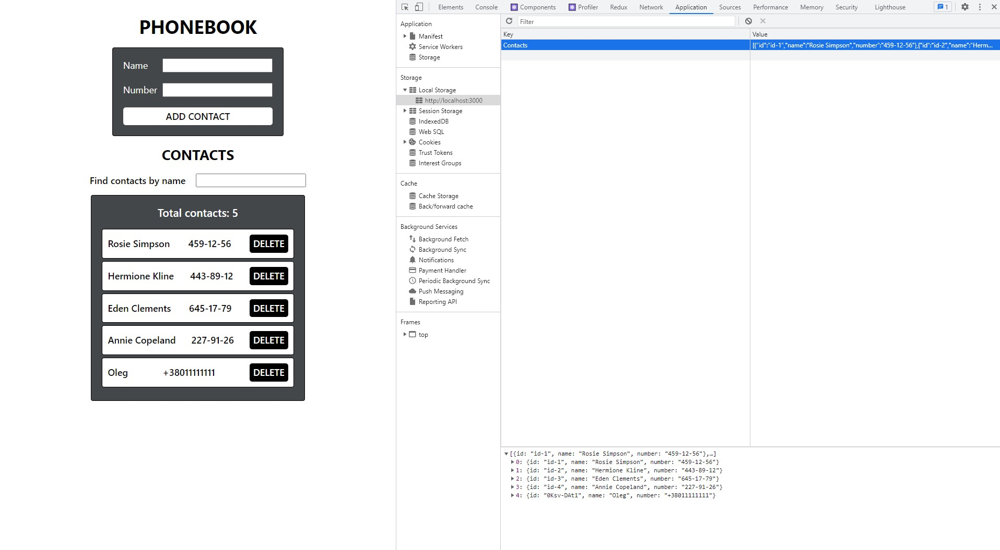

# React phonebook start with life cycle

#### 1. I took my previous application as a basis:

[react-phonebook-start](https://github.com/GnatykOleg/react-phonebook-start)

#### 2. And added phone contact storage books in localStorage. Using lifecycle methods(componentDidUpdate(), componentDidMount())

#### 3. When adding and deleting a contact, the contacts are saved to the local storage. When the app is loaded, the contacts, if any, are read from the local storage and are written to the state.

